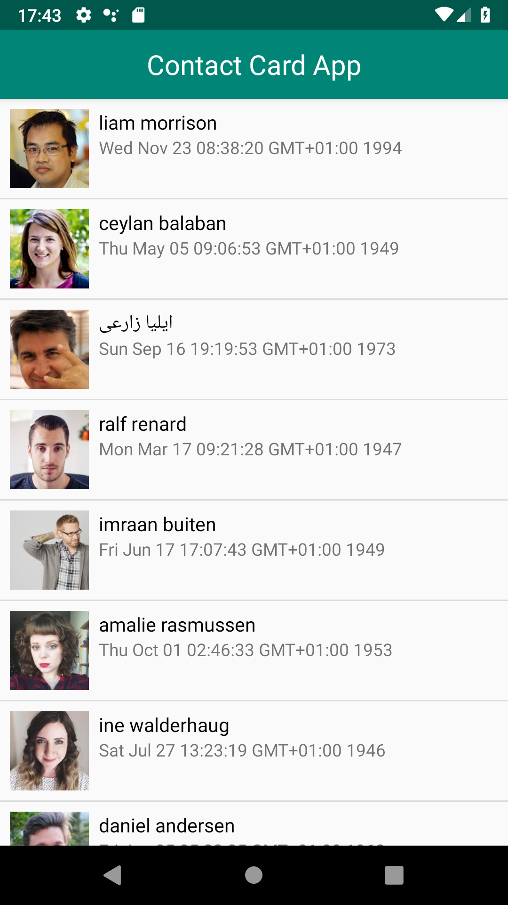
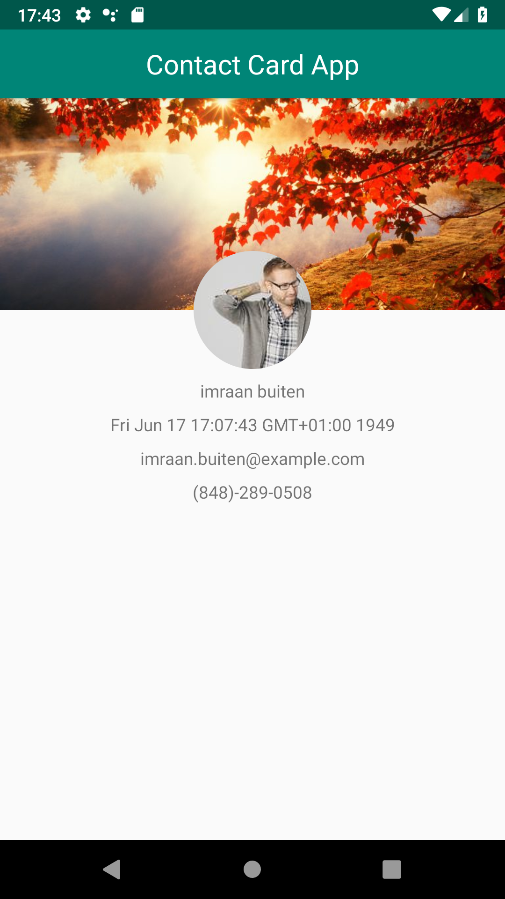

# ContactCardApp

An example app to demonstrate how to:
- Work with ListViews in Android
- Map rows to the ListView itself
- Implement a custom adapter in order to do the previous two things
- Work with JSON data and networking via a RESTful API
- Switch between intents

### Screenshots

